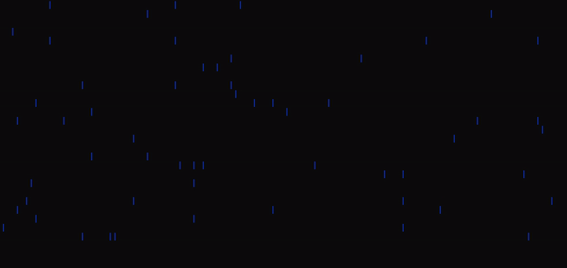
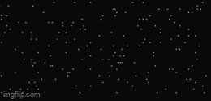

A fun and simple CLI command written in C.





Installation:
```git clone https://github.com/LunarianLime/cRain```

Build the file by running
```cd build && make```
And run it with
```./rain```

Usage:
```./rain -h: displays all available commands
   ./rain -s <char>: will use <char> to represent the rain particles
   .rain -c [1..7]: will use the corresponding colour
```
